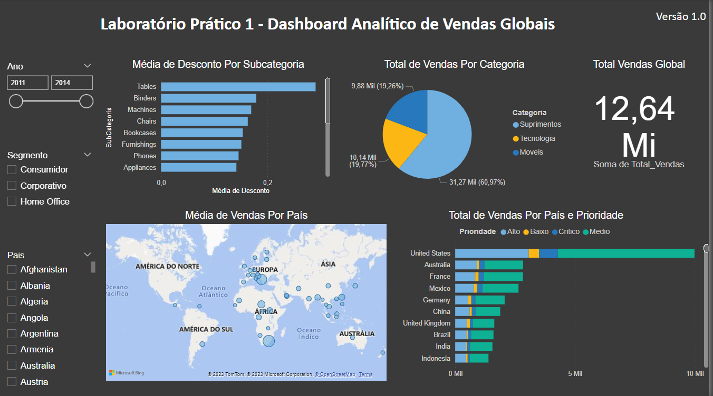

# Laboratório Prático 1

## Análise de Vendas Globais

No Lab 1 vamos construir nosso primeiro Dashboard do curso. Vamos trabalhar com
dados de vendas de uma empresa fictícia que comercializa produtos em todos os cantos do
mundo.

O dataset está disponível para download no ícone de anexo
no canto superior direito.

Nosso Dashboard deve responder as perguntas abaixo:

• Pergunta 1 - Qual o valor total vendido?

• Pergunta 2 - Quantas vendas foram realizadas por categoria de produto?

• Pergunta 3 - Quantas vendas foram realizadas por país considerando a prioridade de
entrega?

• Pergunta 4 - Qual foi a média de desconto nas vendas por subcategoria de produto?

• Pergunta 5 - Quais países tiveram maior média de valor de venda? Demonstre em um
mapa.

E nosso Dashboard deve dar ao usuário a possibilidade de filtrar os dados por ano, por
segmento e por país. Vamos ao trabalho!

## Dashboard

