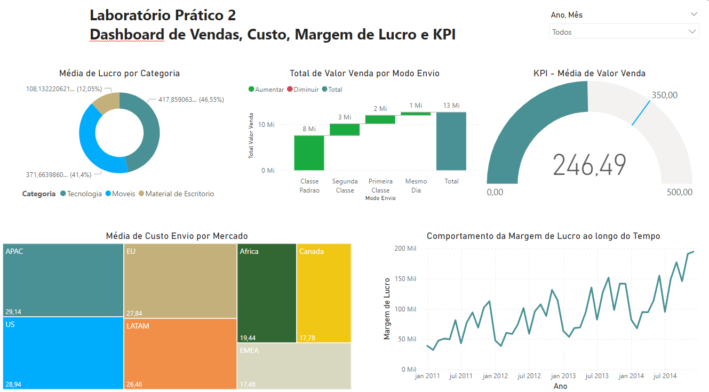

# Laboratório Prático 2

## Análise de Vendas, Custo, Margem de Lucro e KPI

Este é um dos módulos mais importantes deste treinamento.

Muitas pessoas que usam o Power BI sem o devido conhecimento acabam criando
gráficos e dashboards lindos visualmente, mas que transmitem informação incorreta.

Por quê? Porque não criam um modelo de dados e não estabelecem relacionamentos
entre os dados no Power BI. Não queremos que isso aconteça com você e vamos explicar os
conceitos, mostrar as implicações de não usá-los corretamente e, claro, aplicar os conceitos na
prática usando o Power BI.

E faremos tudo isso trabalhando no segundo laboratório prático do curso. 

Abaixo estão as perguntas de negócio do Lab 2. 

1- Qual foi o total de valor venda considerando cada modo de envio dos pedidos? Use
um gráfico de cascata.

2- Quais mercados tiveram o maior custo médio de envio dos produtos vendidos? Use
um gráfico treemap.

3- A empresa tem como objetivo (meta) manter uma média de 350 para o valor de venda
todos os meses. Mostre um indicador (KPI – Key Performance Indicator) com o valor
médio de venda. A empresa ficou abaixo ou acima da meta no mês de Abril/2014?

4- Considere que o lucro é equivalente a: valor venda - custo envio. Qual categoria de
produto apresentou maior lucro médio.

5- Qual foi o comportamento da margem de lucro ao longo do tempo? Considere a
margem de lucro como o lucro dividido pelo valor venda.

## Dashboard

