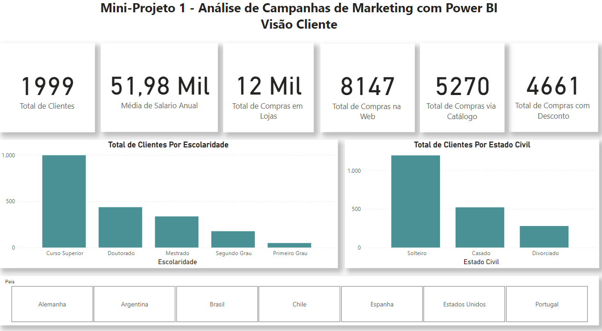
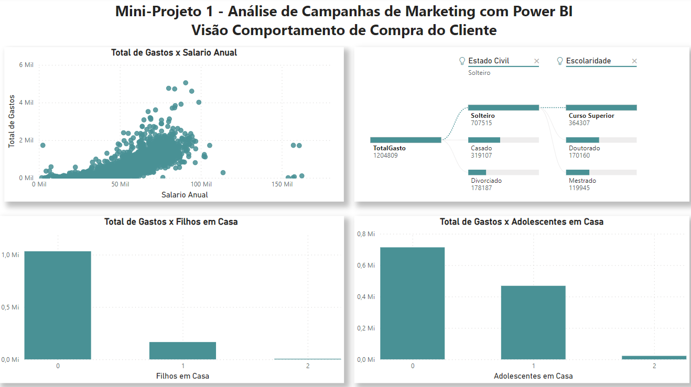
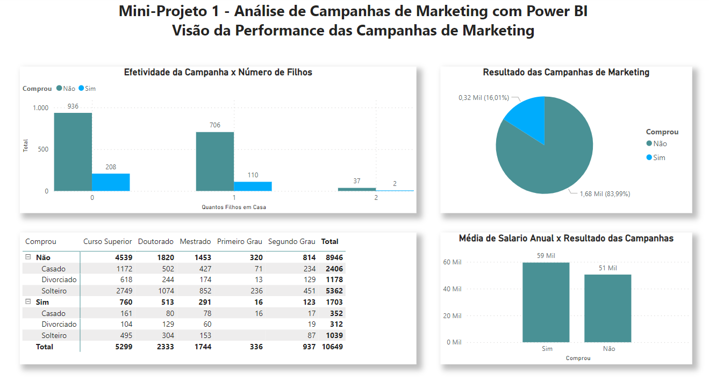
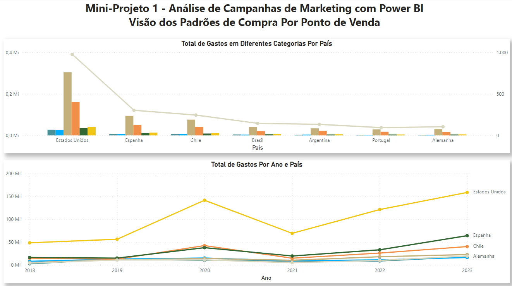

# Mini Projeto 1

## Análise de Campanhas de Marketing 

Este é o início de uma sequência de 6 módulos em que vamos trazer para você mais do que o Power BI. Vamos ensinar como trabalhar comdiferentes áreas de negócio, começando agora pela área de Marketing.

O objetivo deste Mini Projeto é colocar você em um cenário de negócio, um ambiente
real, exatamente como você vai encontrar no mercado de trabalho e da mesma forma que
trazemos os projetos para os alunos da Data Science Academy.

Serão 4 Dashboards e mais de 10 gráficos, além de diversos recursos do Power BI.

## Dashboard

