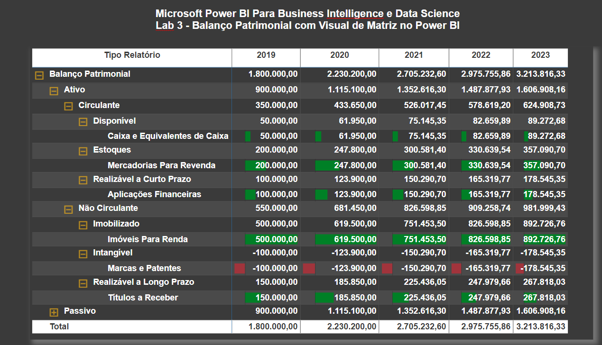

# Laboratório Prático 3

## Balanço Patrimonial com Visual de Matriz

Neste módulo vamos trabalhar no Lab 3 e construir um importante relatório contábil no Power BI, o Balanço Patrimonial. 

## Dashboard

