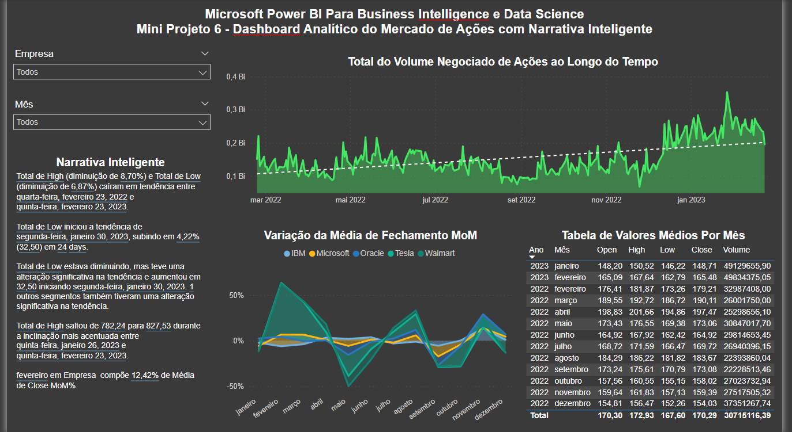

# Mini Projeto 6

## Análise do Mercado de Ações com Narrativa Inteligente

Neste módulo vamos trabalhar no Mini Projeto 6 e construir um Dashboard Analítico do Mercado de Ações. Duas funcionalidades do
Power BI serão exploradas neste capítulo: a Narrativa Inteligente e a manipulação de data.

## Dashboard

