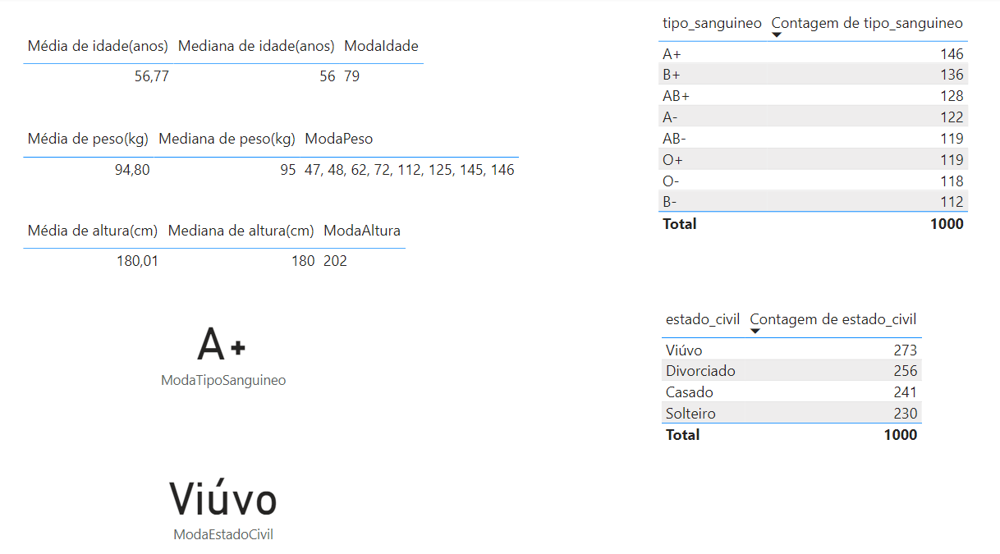
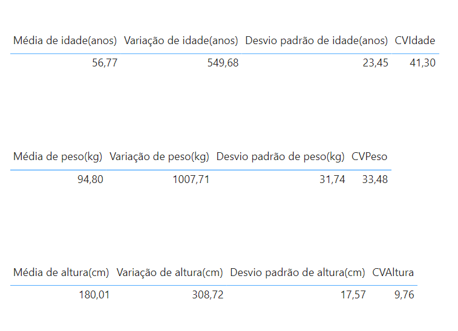

# Módulo 11

## Estatística Fundamental para Data Science

Neste módulo vamos trazer para você uma introdução à Estatística Fundamental Para Data Science com diversos conceitos que serão usados nos capítulos seguintes.

## Dashboard 1

## Dashboard 2

### Bibliografia

[American Statistical Association](https://www.amstat.org/)

[An Introduction to Statistical Learning](https://www.statlearning.com)

