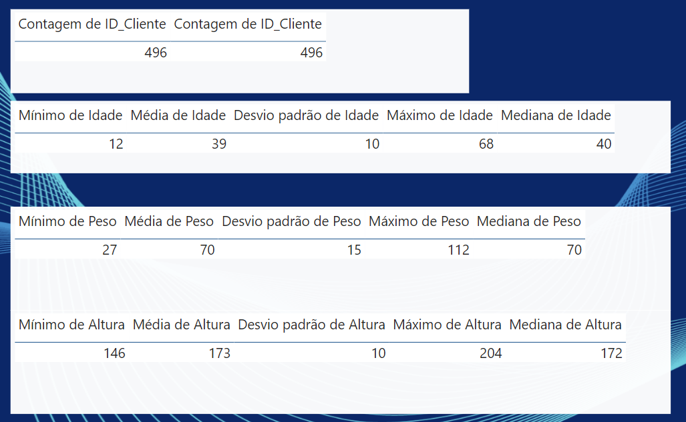
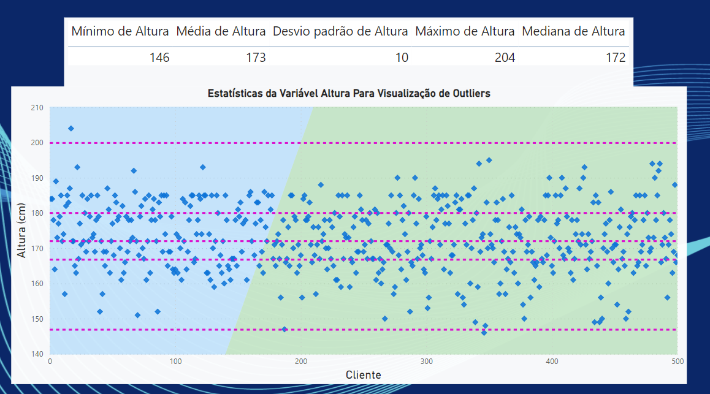

# Laboratório Prático 4

## Limpeza e Manipulação de Dados

A  partir  deste  módulo  a dinâmica  do  curso  será diferente.Não usaremos o Power BI apenas como ferramenta de análise e visualização de dados, mas  sim  como  ferramenta  de  limpeza,  manipulação  e  processamento  de  dados. E  quando  o Power BI não puder ser usado na sua forma nativa vamos complementar o trabalho com outras ferramentas. Agora, neste módulo, vamos focar em Limpeza e Manipulação de Dados com Power BI.

## Dashboard

### Bibliografia

[R Graph Gallery](https://r-graph-gallery.com)
