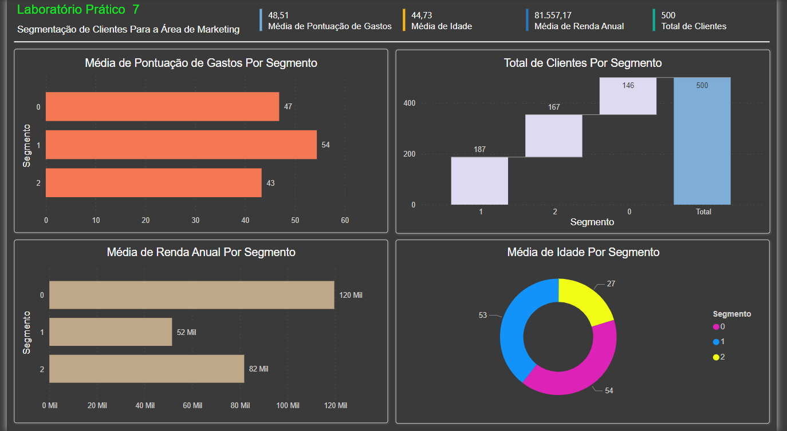

# Laboratório Prático 7

## Machine Learning com Python e Power BI

Neste módulo vamos razer  para  você uma  breve introdução  ao  universo  do  aprendizado  de  máquina  (Machine  Learning)  e  em  que  etapa  do processo o Power BI pode ser usado.

Imagine que uma empresa tenha dados históricosde clientes que fizeram compras de produtos ou serviços. Os dados incluem, para cada cliente: idade, renda anual e uma pontuação de gasto(poder de compra do cliente).
A empresa gostaria de segmentar esses clientes em 3 grupos de acordo com similaridades a fim de personalizar as campanhas de Marketing.

O gestor da área de Marketing espera receber um relatório com os 3 segmentos e para cada segmento a média de idade, renda anual e pontuação de gastos dos clientes.

Seu trabalho é fazer isso acontecer! E para isso você vai precisar de Machine Learning.

## Dashboard

### Bibliografia

[Power BI Client](https://pypi.org/project/powerbiclient)