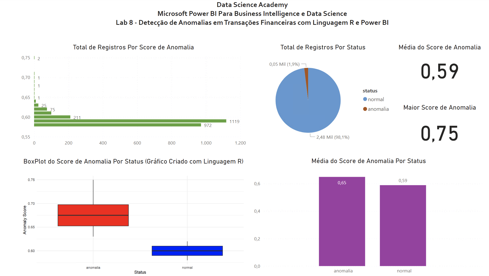

# Laboratório Prático 8

## Detecção de Anomalias em Transações Financeiras com R e Power BI

Neste módulo vamos razer para você mais uma breve introdução ao universo do aprendizado de máquina (Machine Learning), mas dessa vez com outra ferramenta em conjunto com o Power BI, a Linguagem R, uma linguagem estatística amplamente usada em Data Science.

Imagine que uma empresa da área financeira tenha dados históricos de clientescom duas transações financeiras (aqui chamadas de “transacao1” e “transacao2”). Os gestores acreditam que algumas dessas transações possam ser fraudulentas e gostariam de identificar as eventuais anomalias. Os gestores não fazem ideia do que seria uma anomalia e pediram sua ajuda para encontrar uma solução. De fato, eles não sabem se anomalias realmente ocorreram.

Usando dados fictícios usaremos Machine Learning par agrupar os dados de transações financeiras dos clientes e então detectar e definir as anomalias (se existirem).

## Dashboard

