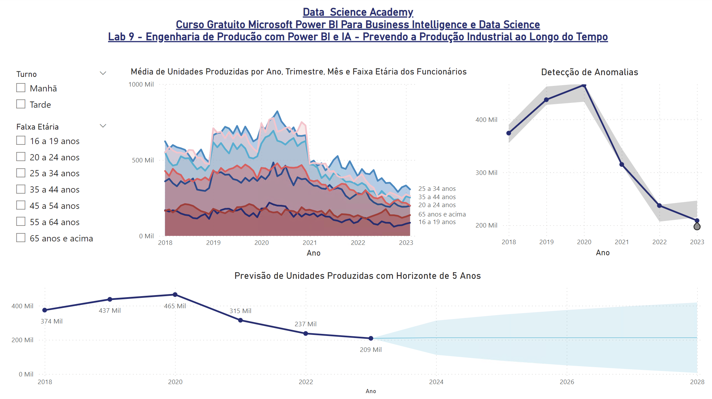

# Laboratório Prático 9

## Engenharia de Produção com IA - Prevendo a Produção Industrial ao Longo do Tempo

Neste módulo vamos trazer  para  você uma  breve introdução à análise de séries temporais e demonstrar alguns recursos de Inteligência Artificial disponíveis no Power BI.

Neste Lab o Power BI é usado para manipular e compreender os dados, explorando alguns conceitos de análise de séries temporais. Por fim, são apresentados recursos de IA do Power BI paraprever a média de unidades produzidas ao longo do tempo e detecção de anomalias. O Dashboard criado ao final do Lab serve como ponto de partida para o dia a dia de Engenheiros de Produção.

## Dashboard

